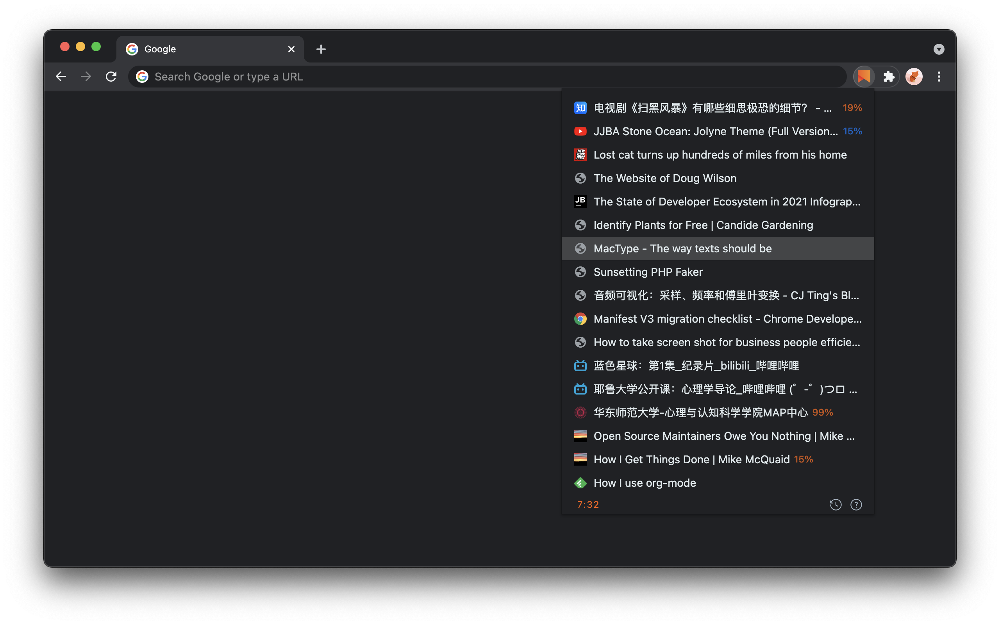

   
  Dedicated to my good friend <a href="https://github.com/evestorm">@evestorm</a> 
  A temporary bookmark focuses on reading later, rather than closing and removing.

Please rate it on [chrome web store](https://chrome.google.com/webstore/detail/fbmfcfkokefgbmfcjahdmomlifclekib/) or star it on github if you like it. Your encouragement will help me make it better, thanks!

## Installation
**Click the image** below to install:

**Manual Installation**:
1. Download [chrome-read-later.zip](https://github.com/willbchang/chrome-read-later/releases/latest).
2. Unzip it and move it to the safe path(you won't delete it accidentally).
3. Go to `chrome://extensions/`
4. Open `Developer mode`.
5. Drag the folder to chrome or Click `Load unpacked` and select the folder.

## Features
### Reading List
- **Reading Progress**: It saves the reading progress of current page.
- **Sync in Cloud**: Sync across Chrome browsers with one google account.
- **Local History**: Save the reading list history locally.

### Status Bar
- **Row Number : Total Count**
- **History Icon**: Click to on/off history mode.
- **Info Icon**: Click to open the documentation & feedback page.

## Usages
**Windows and Mac Keyboard Differences**

| Mac Key  | Windows Key |
|:--------:|:-----------:|
| Control  | Ctrl        |
| Option   | Alt         |
| Command  | Windows     |
| Delete   | Backspace   |

### Mouse Click
**Current Page**:
- `Right Click` a *link* and select **Save to Read Later** in context menus to save the target link info.
- `Right Click` *current page* and select **Save to Read Later** in context menus to save page info and close current tab.
- `Click` the read later icon to open the **Reading List**(Popup Window).

**Reading List**(Popup Window):
- `Mouse Hover(Text)`: **show** full title and link.
- `Mouse Hover(image)`: **show** the delete icon.
- `Click`: **open** link in **current tab**.
- `Click(image)`: **delete** current link.
- <kbd>Alt</kbd> + `Click`: **open** link in a **new tab**.
- <kbd>Command</kbd> + `Click`: **open** link in a **new tab** and **stay** in **current tab** with **reading list** stay.

### Keyboard Shortcuts
**Current Page**:
- <kbd>Alt</kbd> + <kbd>Shift</kbd> + <kbd>S</kbd>: **Save** to reading list.
- <kbd>Alt</kbd> + <kbd>Shift</kbd> + <kbd>Z</kbd>: **Zoom In/Out** reading list.

If you pressed the shortcuts and it didn't work, please enter `chrome://extensions/shortcuts` in your address bar.
Find **Read Later** and set the shortcuts(resolve the keyboard shortcuts conflicts)

**Reading List**(Popup Window):
- <kbd>↑</kbd>: **move** to **previous** link.
- <kbd>↓</kbd>: **move** to **next** link.
- <kbd>Delete</kbd>: **delete** current link.
- <kbd>Command</kbd> + <kbd>z</kbd>: **restore** a deletion.
- <kbd>Enter</kbd>: **open** select link in **current tab**.
- <kbd>Alt</kbd> + <kbd>Enter</kbd>: **open** link in a **new tab**.
- <kbd>Command</kbd> + <kbd>Enter</kbd>: **open** link in a **new tab** and **stay** in **current tab** with **reading list** stay.
- <kbd>Command</kbd> + <kbd>↑</kbd>: **move** to the **first** link.
- <kbd>Command</kbd> + <kbd>↓</kbd>: **move** to the **last** link.

**For Vim user**(Popup Window):
- <kbd>Esc</kbd>: **close reading list**.
- <kbd>j</kbd>: **move** to **next** link.
- <kbd>k</kbd>: **move** to **previous** link.
- <kbd>gg</kbd>: **move** to the **first** link.
- <kbd>G</kbd>: **move** to the **last** link.
- <kbd>o</kbd>: **open** select link in **current tab**.
- <kbd>O</kbd>: **open** link in a **new tab** and **stay** in **current tab** with **reading list** stay.
- <kbd>dd</kbd>: **delete** current link.
- <kbd>u</kbd>: **restore** a deletion.
- <kbd>yy</kbd>: **copy** current link.
- <kbd>?</kbd>: **open** documentation & feedback site.

## Note
- Save reading progress works on most pages(I'm improving it).
- Remove the extension will delete the reading list in the cloud, **it cannot be restored**.
- The maximum reading list in cloud is up to 250 items, due to google's limits.
- It may be slow if the reading list in history is near to 10,000 items.

## Contribution
Any suggestions / PR are welcome, if you feel like there is room to improve. Please open an issue to discussion first.
- UI
- UX
- Refactoring / Code Quality
- New Features

### TODO
- [ ] Record/Set video/audio progress.
- [ ] Get/Set all scroll bars' position.
- [ ] Cache the reading list to instantly open.
- [ ] Improve the vim code logic(more dynamic).

## Credits
- Logo is designed by [Yasujizr](https://github.com/Yasujizr).
- Delete icon is made by <a href="https://www.flaticon.com/authors/freepik" title="Freepik">Freepik</a> from <a href="https://www.flaticon.com/" title="Flaticon"> www.flaticon.com </a>
- Icons in status bar are [Octicons](https://primer.style/octicons/)
- I use [RubyMine](https://www.jetbrains.com/ruby/) to make this extension, it improves my productivity a lot!
- Special thanks to my girl friend YangYang, she gave me a lot of helpful suggestions, feedback and encouragement.

## LICENSE
[AGPL-3.0](LICENSE)
