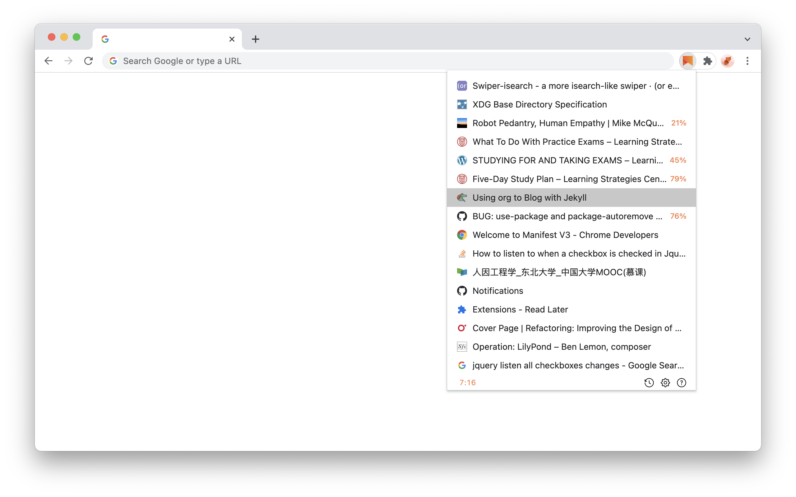

   
  Dedicated to my good friend <a href="https://github.com/evestorm">@evestorm</a> 
  A temporary bookmark focuses on reading later, rather than closing and removing.

  
  

  

Please rate it on [chrome web store](https://chrome.google.com/webstore/detail/fbmfcfkokefgbmfcjahdmomlifclekib/) or star it on github if you like it. Your encouragement will help me make it better, thanks!

## Installation
**Click the image** below to install:

**Manual Installation**:
1. Download [chrome-read-later.zip](https://github.com/willbchang/chrome-read-later/releases/latest).
2. Unzip it and move it to the safe path(you won't delete it accidentally).
3. Go to `chrome://extensions/`
4. Open `Developer mode`.
5. Drag the folder to chrome or Click `Load unpacked` and select the folder.

## Features
### Reading List
- **Reading Progress**: It gets and sets the reading progress of current page.
- **Video Progress**: It gets and sets the current time and the playback rate of the frist video.
- **Sync in Cloud**: Sync across Chrome browsers with one google account.
- **Local History**: Save the reading list history locally.

### Status Bar
- **Row Number : Total Count**
- **History Icon**: Click to on/off history mode.
- **Question Icon**: Click to open the documentation & feedback page.

## Usages
**Windows and Mac Keyboard Differences**

| Mac Key  | Windows Key |
|:--------:|:-----------:|
| Control  | Ctrl        |
| Option   | Alt         |
| Command  | Windows     |
| Delete   | Backspace   |

### Website
- `Right Click` *current page* and select **Save to Read Later** in context menus to save page info and close current tab.
- `Right Click` a *link* and select **Save to Read Later** in context menus to save the target link info.
- `Click` the read later icon to open the **Reading List**(Popup Window).
- <kbd>Alt</kbd> + <kbd>Shift</kbd> + <kbd>S</kbd>: **Save** to reading list.
- <kbd>Alt</kbd> + <kbd>Shift</kbd> + <kbd>Z</kbd>: **Zoom In/Out** reading list.

If you pressed the shortcuts and it didn't work, please enter `chrome://extensions/shortcuts` in your address bar.
Find **Read Later** and set the shortcuts(resolve the keyboard shortcuts conflicts)

### Popup

| Features                                  | Mouse                        | Keyboard                                         | VIM                           |
|-------------------------------------------|------------------------------|--------------------------------------------------|-------------------------------|
| Close reading list                        | `Click` extension icon       | <kbd>Alt</kbd> + <kbd>Shift</kbd> + <kbd>z</kbd> | <kbd>Esc</kbd>                |
| Open in Current tab                       | `Click`                      | <kbd>Enter</kbd>                                 | <kbd>o</kbd>                  |
| Open in a New tab and Stay in Current tab | <kbd>Command</kbd> + `Click` | <kbd>Command</kbd> + <kbd>Enter</kbd>            | <kbd>O</kbd>                  |
| Open in a New tab                         | <kbd>Alt</kbd> + `Click`     | <kbd>Alt</kbd> + <kbd>Enter</kbd>                | <kbd>alt</kbd> + <kbd>o</kbd> |
| Delete                                    | `Hover` favicon and `Click`  | <kbd>Delete</kbd>                                | <kbd>dd</kbd>                 |
| Move to Next                              | Move Down                    | <kbd>↓</kbd>                                     | <kbd>j</kbd>                  |
| Move to Previous                          | Move Up                      | <kbd>↑</kbd>                                     | <kbd>k</kbd>                  |
| Move to Top                               | Scroll to Top                | <kbd>Command</kbd> + <kbd>↑</kbd>                | <kbd>gg</kbd>                 |
| Move to Bottom                            | Scroll to End                | <kbd>Command</kbd> + <kbd>↓</kbd>                | <kbd>G</kbd>                  |
| Restore a deletion                        | \                            | <kbd>Command</kbd> + <kbd>z</kbd>                | <kbd>u</kbd>                  |
| Copy link address                         | \                            | \                                                | <kbd>yy</kbd>                 |
| on/off history mode                       | Click History icon           | \                                                | <kbd>H</kbd>                  |
| Open documentation & feedback site        | Click Question icon          | \                                                | <kbd>?</kbd>                  |
| Show full title and link                  | `Hover` text                 | \                                                | \                             |

## Note
- Save reading progress works on most pages(I'm improving it).
- Remove the extension will delete the reading list in the cloud, **it cannot be restored**.
- The maximum reading list in cloud is up to 250 items, due to google's limits.
- It may be slow if the reading list in history is near to 10,000 items.

## Contribution
Any suggestions / PR are welcome, if you feel like there is room to improve. Please open an issue to discussion first.
- UI
- UX
- Refactoring / Code Quality
- New Features

### TODO
- [ ] Cache the reading list to instantly open.
- [ ] Improve the vim code logic(more dynamic).

## Credits
- Logo is designed by [Yasujizr](https://github.com/Yasujizr).
- Delete icon is made by <a href="https://www.flaticon.com/authors/freepik" title="Freepik">Freepik</a>.
- Icons in status bar are [Octicons](https://primer.style/octicons/).
- I use [RubyMine](https://www.jetbrains.com/ruby/) to make this extension, it improves my productivity a lot!
- Special thanks to my girl friend YangYang, she gave me a lot of helpful suggestions, feedback and encouragement.

## LICENSE
[AGPL-3.0](LICENSE)
