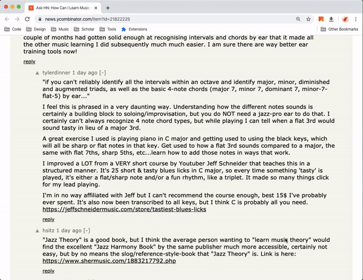
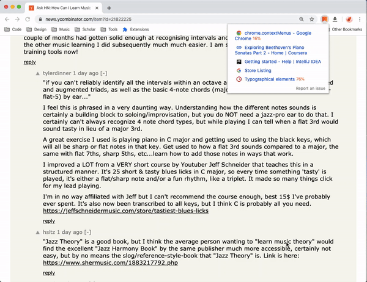
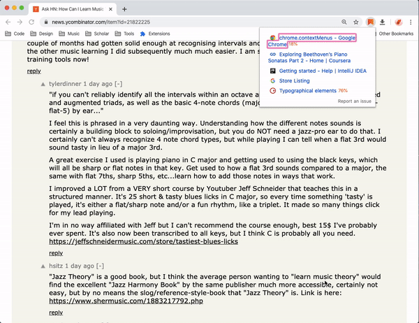
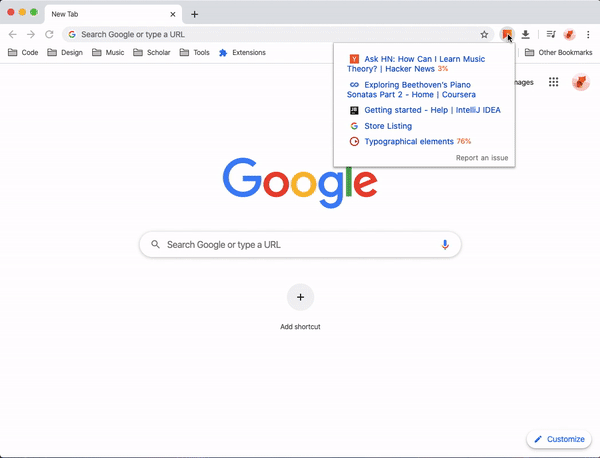

   
  Dedicated to my good friend <a href="https://github.com/evestorm">@evestorm</a> 
  A Chrome extension focuses on reading later, rather than closing and removing.

## Installation

### Manually
1. [Download this repo](https://github.com/willbchang/chrome-read-later/releases/latest).
2. Move it to the safe path(you won't delete it accidentally).
3. Go to `chrome://extensions/`
4. Open `Developer mode`.
5. Click `Load unpacked` and select the folder.

## Usages
### Keyboard Shortcuts
Config shortcuts: `chrome://extensions/shortcuts`, the last two are unable to config for now.
- **Save current page info**: <kbd>alt</kbd> + <kbd>shift</kbd> + <kbd>s</kbd>
  
- **Zoom out reading list**: <kbd>alt</kbd> + <kbd>shift</kbd> + <kbd>z</kbd>
  
- Select items by <kbd>tab</kbd> and <kbd>shift</kbd> + <kbd>tab</kbd>.
  
- Use <kbd>enter</kbd> to open selected item. 
  

### Mouse Click
- Left click the icon to open the reading List.
  
- Left click the link to open in browser.
  
- Right click Link and select Read Later in context menus to fetch and save page info.
  
- Right click page and select Read Later in context menus to save page info.
  

## Features
- It saves almost all kinds of pages in any situation: `http://`, `https://`, `chrome://`, `localhost:`...
- It saves the reading progress of current page, **works on most pages**(I'll improve it later).
- It syncs to your browser(sign in google account first) automatically, you can use one reading list with multiple Chrome Browsers.
- It saves page's favicon as `Base64`, only needs to be saved once per page.

### TODO
- Test
  - [ ] JS Test Framework: [Mocha](https://mochajs.org)
  - [ ] [Refactoring](https://learning.oreilly.com/library/view/refactoring-improving-the/9780134757681): Chapter 2 ~ 4
- CORS `V2.1.0`
  - [ ] Build cors-anywhere on heroku.
  - [ ] Apply to `fetch` request. 
- Get/Set Scroll Left `V2.2.0`
- Get/Set Multiple Scroll Position `V2.3.0`
- Get/Set Video/Audio info `V3.0.0`
  - [ ] Find video/audio. [resource](https://github.com/igrigorik/videospeed/blob/master/inject.js)
  - [ ] Current time.
  - [ ] Video screen size.
  - [ ] Video/Audio play speed.
- Vim Mode `V4.0.0`
  - [ ] <kbd>j</kbd>: focus to next link.
  - [ ] <kbd>k</kbd>: focus to previous link.
  - [ ] <kbd>g</kbd>
    - [ ] <kbd>gg</kbd>: focus to the first link.
    - [ ] <kbd>G</kbd>: focus to the last link.
  - [ ] <kbd>d</kbd>
    - [ ] <kbd>dd</kbd>: delete a focused link.
    - [ ] <kbd>d</kbd>@{num}<kbd>d</kbd>: delete x links.
  - [ ] <kbd>/</kbd> search links' title.

### Known Issues
- Cannot save scroll position from `*.google.com`, `https://manga.bilibili.com/*`, or some sites has multiple scroll bars.

## Contribution
This is my first real world problem project. If you feel the code is hard to read or understand, pull request is always welcome.
[data.mjs](https://github.com/willbchang/chrome-read-later/blob/master/modules/data.mjs)'s code structure is learned from [Refactoring Chapter 1](https://learning.oreilly.com/library/view/refactoring-improving-the/9780134757681/).

### Dependencies
Run `pnpm install` or `npm install`, check [package.json](https://github.com/willbchang/chrome-read-later/blob/master/package.json#L22) for details. 

### Code Style
- [Clean Code JavaScript](https://github.com/ryanmcdermott/clean-code-javascript#introduction)
- [Git Style Guide](https://udacity.github.io/git-styleguide/)

### Documentation
Any improvement to README, issue-template... is welcome.

### Language Specification
- I'm not a native speaker, welcome to pull request if there is any typo or grammar issue.
- Internationalization translations are also welcome! Pull request now!

### Contributor
|                              Logo Designer                              |
| :---------------------------------------------------------------------: |
|  |
|                 [Yasujizr](https://github.com/Yasujizr)                 |

## Credits

## LICENSE
[MIT](LICENSE)
